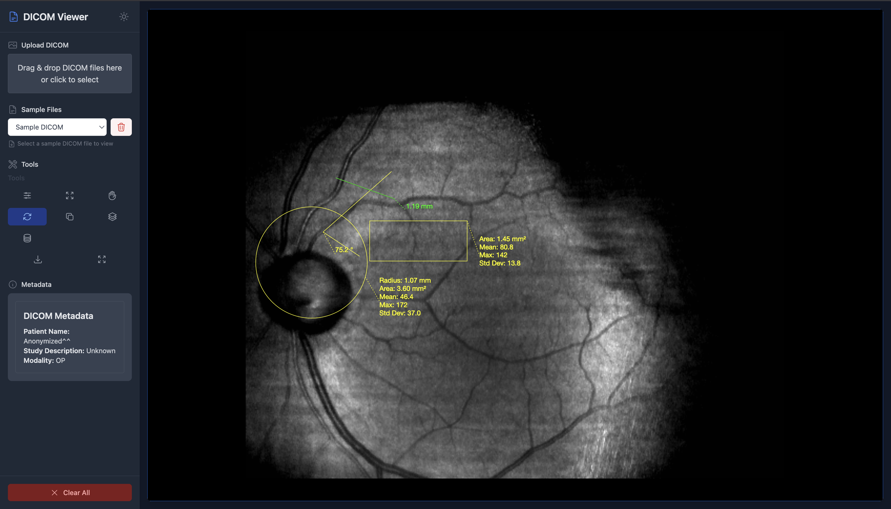
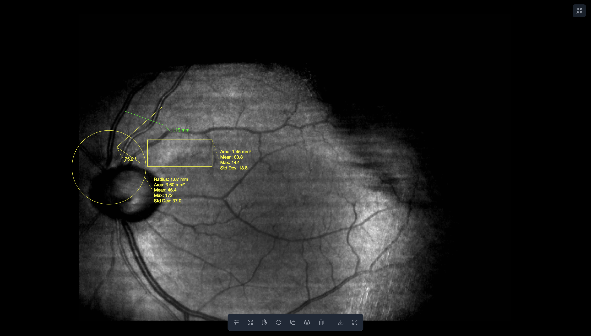

# DICOM Viewer



A modern web-based DICOM viewer built with React, TypeScript, and Cornerstone.js. This application provides a user-friendly interface for viewing and analyzing DICOM medical images with various measurement and annotation tools.

## Features

- 🖼️ View DICOM images with high-quality rendering
- 📏 Measurement tools (Length, Angle, Rectangle ROI, Circle ROI)
- 🎨 Window Level adjustment for better image contrast
- 🔍 Zoom and Pan capabilities
- 💾 Download images with annotations
- 🌓 Dark mode support
- 📱 Responsive design
- 🔄 Web Worker for efficient DICOM decoding
- 💾 IndexedDB storage for offline access
- 🖥️ Fullscreen mode with floating tools

## Getting Started

### Prerequisites

- Node.js (v14 or higher)
- npm or yarn

### Installation

1. Clone the repository:

```bash
git clone https://github.com/yourusername/dicom-viewer.git
cd dicom-viewer
```

2. Install dependencies:

```bash
npm install
```

3. Start the development server:

```bash
npm start
```

4. Open your browser and navigate to `http://localhost:8080`

## Project Structure

```
dicom-viewer/
├── src/
│   ├── components/     # React components
│   ├── hooks/         # Custom React hooks
│   ├── lib/           # Utility functions and setup
│   ├── workers/       # Web Workers
│   └── main.tsx       # Application entry point
├── public/
│   └── assets/        # Sample DICOM files
└── screens/           # Screenshots
```

## Usage

1. Upload a DICOM file using the upload button or drag and drop
2. Use the toolbar to select different measurement tools
3. Click and drag on the image to make measurements
4. Use the mouse wheel to zoom in/out
5. Right-click and drag to pan the image
6. Use the Window Level tool to adjust image contrast
7. Download the image with annotations using the download button
8. Toggle fullscreen mode for a distraction-free viewing experience

## Technologies Used

- React
- TypeScript
- Cornerstone.js
- Tailwind CSS
- Web Workers
- IndexedDB
- HTML5 Canvas

## Screenshots

### Dark Mode


### Floating Tools in Fullscreen Mode



## License

This project is licensed under the MIT License - see the [LICENSE](LICENSE) file for details.

## Contributing

1. Fork the repository
2. Create your feature branch (`git checkout -b feature/amazing-feature`)
3. Commit your changes (`git commit -m 'Add some amazing feature'`)
4. Push to the branch (`git push origin feature/amazing-feature`)
5. Open a Pull Request

## Acknowledgments

- [Cornerstone.js](https://github.com/cornerstonejs/cornerstone) for the DICOM rendering engine
- [Tailwind CSS](https://tailwindcss.com/) for the styling framework
- [Heroicons](https://heroicons.com/) for the beautiful icons
