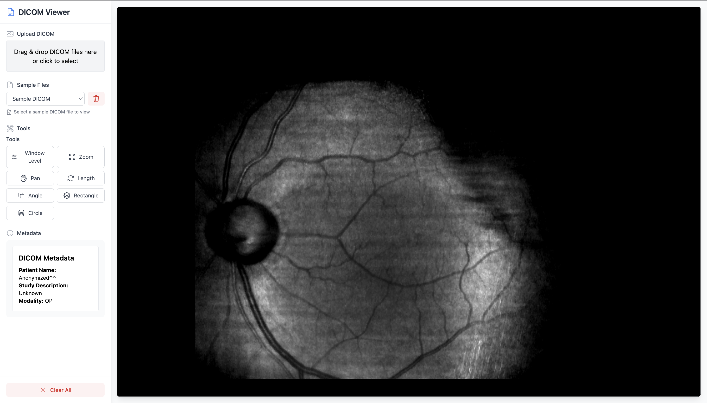

# DICOM Viewer



A modern, interactive DICOM viewer built with React, Cornerstone3D, and Tailwind CSS. This application allows you to upload, view, and interact with DICOM medical images directly in your browser. It features measurement tools, metadata display, and a clean, user-friendly interface.

## Features

- **DICOM Upload**: Drag and drop or select DICOM files to view.
- **Sample Files**: Quickly load sample DICOM images for demo or testing.
- **Measurement Tools**: Window Level, Zoom, Pan, Length, Angle, Rectangle ROI, and Circle ROI tools with intuitive controls.
- **Metadata Panel**: View key DICOM metadata for the loaded image.
- **Modern UI**: Responsive sidebar, Heroicons, and Tailwind CSS styling.
- **IndexedDB Storage**: Store and manage uploaded/sample files in the browser.
- **Test Coverage**: Custom hooks and components are covered by unit tests.
- **Web Workers for Decoding**: Efficient DICOM image decoding using web workers for performance.

## Web Worker Usage

This project leverages web workers to offload DICOM image decoding (such as JPEG and JPEG2000) from the main UI thread. By using the Cornerstone3D codecs (e.g., libjpeg-turbo, OpenJPEG) in a worker context, the viewer can efficiently decode large medical images without blocking the user interface, resulting in a smoother and more responsive experience.

- The codecs are loaded and initialized in a separate thread via web workers.
- This allows for parallel processing and improved performance, especially with large or complex DICOM files.
- The setup is handled automatically by the Cornerstone3D libraries and the project configuration.

## Getting Started

### Prerequisites

- Node.js (v16 or later recommended)
- npm

### Installation

```bash
npm install
```

### Running the App

```bash
npm start
```

Open [http://localhost:8080](http://localhost:8080) in your browser.

### Running Tests

```bash
npm test
```

## Project Structure

- `src/components/` — React components (Viewer, ToolControls, SampleSelector, etc.)
- `src/hooks/` — Custom React hooks for tool management and configuration
- `src/hooks/__tests__/` — Unit tests for hooks
- `src/components/__tests__/` — Unit tests for components
- `public/` — Static assets (including `screenshot.png`)

## Usage

1. **Upload DICOM**: Drag and drop or click to select a DICOM file.
2. **Sample Files**: Use the dropdown to load a sample DICOM image.
3. **Tools**: Select a tool from the sidebar to interact with the image (window/level, zoom, pan, measure, etc.).
4. **Metadata**: View DICOM metadata in the sidebar.
5. **Clear All**: Remove all loaded files and reset the viewer.

## Technologies Used

- [React](https://react.dev/)
- [Cornerstone3D](https://www.cornerstonejs.org/)
- [Tailwind CSS](https://tailwindcss.com/)
- [Heroicons](https://heroicons.com/)
- [Jest](https://jestjs.io/) & [Testing Library](https://testing-library.com/)

## Screenshot


## License

MIT
